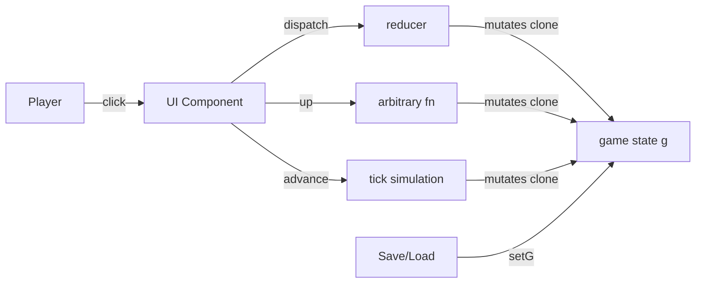

# State Standard — (Current State Discovery)

> **Domain:** Game state ownership, mutation, data flow, action dispatch
> **Source:** MMA Manager codebase (`app/src/`)
> **Discovery Date:** July 2026
> **Version:** 1.0

---

## 1 — Purpose

This document defines how game state is owned, mutated, and distributed across the MMA Manager codebase. It answers: who owns `g`, who can change it, how changes flow from the player's click to a state update, and where each mutation mechanism (`dispatch` / `up` / `advance` / `setG`) should be used.

This is a **discovery document**. The patterns reflect the actual implementation in App.jsx, useGameState, useSaveLoad, reducer.js, state.js, and every page component that reads or mutates state.

---

## 2 — Discovery Summary

### Files Analyzed

| # | File | Role |
|---|------|------|
| 1 | `App.jsx` | Shell — owns `g`, distributes state + mutation functions |
| 2 | `hooks/useGameState.js` | Core — `up()`, `dispatch()`, `advance()` implementation |
| 3 | `hooks/useSaveLoad.js` | Persistence — `setG` for save/load/migration |
| 4 | `hooks/useKeyboard.js` | Shortcuts — calls `advance` + `dispatch` |
| 5 | `engine/reducer.js` | Dispatch target — routes actions to domain reducers |
| 6 | `engine/state.js` | Tick engine — `newGame()` + `tick()` orchestration |
| 7 | `engine/reducer/camp.js` | Domain — facility/tier/sponsor mutations |
| 8 | `engine/reducer/fighter.js` | Domain — fighter action mutations |
| 9 | `engine/reducer/coach.js` | Domain — coach hire/fire |
| 10 | `engine/reducer/contract.js` | Domain — contract signing |
| 11 | `engine/reducer/fight.js` | Domain — fight accept/reject |
| 12 | `engine/reducer/ui.js` | Domain — scout/inbox/event mutations |
| 13 | `ui/Dashboard.jsx` | Page — reads `g`, does NOT mutate |
| 14 | `ui/Inbox.jsx` | Page — reads `g`, calls `dispatch` |
| 15 | `ui/Finance.jsx` | Page — reads `g` only, no dispatch |
| 16 | `ui/Roster.jsx` | Page — reads `g`, calls `dispatch` + `up` |
| 17 | `ui/Facility.jsx` | Page — reads `g`, calls `dispatch` |
| 18 | `ui/Scout.jsx` | Page — reads `g`, calls injected `scoutFighter()` |
| 19 | `ui/RivalsScreen.jsx` | Page — reads `g`, calls `up` |
| 20 | `services/saveService.js` | Persistence — save/load serialization |

### Architecture Snapshot

```
App.jsx  ─── useState(() => newGame())  ───►  g, setG
  │
  ├── useSaveLoad(setG)        ───►  loaded, saveSlot, newGame
  ├── useGameState(g, setG)    ───►  up, dispatch, advance
  ├── useKeyboard({advance, dispatch})
  │
  └──►  Pages receive:  g, dispatch, up (varies by page)
```

### Current State Summary

| Aspect | Current Pattern |
|--------|----------------|
| State origin | `useState(() => newGame())` in App.jsx |
| State type | Single plain JS object (`g`) |
| Clone method | `JSON.parse(JSON.stringify(clone))` inside `up()` |
| Mutation method | In-place mutation on cloned object |
| Reducer pattern | Domain reducers (`reduceCamp`, `reduceFighter`, etc.) — NOT switch-based router |
| Undo | Snapshot-based undo stack in reducer |
| Auto-save | `setTimeout` 1s debounce in `up()` |

---

## 3 — Current State

### 3.1 State Origin

**`g` is created once in App.jsx:**

```jsx
const [g, setG] = useState(() => newGame());
```

`newGame()` in `engine/state.js` assembles the initial state from builder functions (`createEconomy`, `createCamp`, `createRoster`, `createCoaches`, `createWorld`) plus spread operators:

```jsx
export function newGame() {
  return {
    week: 1,
    ...createEconomy(),
    ...createCamp(),
    roster: createRoster(),
    ...createCoaches(),
    ...createWorld(),
    legacy: 0, over: null, won: false,
  };
}
```

**Current state:** `g` is a single flat object. Top-level properties are combined via destructuring spread. No nesting beyond system groupings.

### 3.2 Mutation Entry Points

There are exactly **four ways** game state changes. Every mutation in the codebase goes through one of these four paths.

#### Path 1: `dispatch(action)` — Standard action

```jsx
// Definition (useGameState.js)
const dispatch = (action) => {
  if (action.type === "SIGN_CONTRACT_PRE") {
    setNego({ fighter: action.fighter, ... });
    return; // intercepted for modal
  }
  up((n) => { reducer(n, action); });
};

// Usage (Inbox.jsx)
dispatch({ type: "ACCEPT_FIGHT", fighterId: f.id, offerId: m.id });

// Usage (Facility.jsx)
dispatch({ type: "UPGRADE_FACILITY", facility: "mats" });
```

**Mechanism:**
1. If `SIGN_CONTRACT_PRE` → intercept, show modal, return.
2. Otherwise → call `up()`, inside it call `reducer(gClone, action)`.
3. Reducer applies domain-specific mutations and returns `g`.

**Current state:** `dispatch` is the primary mutation mechanism for all player actions. Every action in the project uses `dispatch`.

#### Path 2: `up(fn)` — Arbitrary mutation

```jsx
// Definition (useGameState.js)
const up = (fn) => setGOrig((old) => {
  const clean = Object.assign({}, old);
  delete clean._undoStack;
  delete clean._redoStack;
  const n = JSON.parse(JSON.stringify(clean));
  fn(n);
  clearTimeout(saveTimer.current);
  saveTimer.current = setTimeout(() => saveGame(saveSlot, n), 1000);
  return n;
});

// Usage (Roster.jsx)
up((n) => { /* direct mutation on n */ });

// Usage (advance internally)
up((n) => { tick(n); ... });
```

**Mechanism:**
1. Strip `_undoStack` and `_redoStack` from the state (they contain circular references).
2. Deep clone via `JSON.parse(JSON.stringify())`.
3. Call `fn(n)` which mutates the clone directly.
4. Schedule auto-save (1s debounce).
5. Return the new state to React.

**Current state:** `up()` is used for complex mutations that don't fit the reducer pattern, or in `advance()` for the weekly tick.

#### Path 3: `advance()` — Weekly tick

```jsx
const advance = () => {
  up((n) => {
    tick(n);
    if (n.log) n.log = n.log.slice(0, 30);
    // check achievements, build weeklySummary
    ...
  });
  setWeekFlash((x) => x + 1);
};
```

**Mechanism:** Calls `up()` wrapping `tick()`. After tick, trims log, checks achievements, and builds the weekly summary overlay data.

**Current state:** `advance` is the only way to advance the game world. Direct calls to `tick()` from components would bypass auto-save and undo.

#### Path 4: `setG(newState)` — Direct replace

```jsx
// In App.jsx (FightNight completion callback)
setG((old) => {
  const n = structuredClone(old);
  fx(n);
  if (fightCtx) checkAchievements(n, fightCtx);
  saveGame(saveSlot, n);
  return n;
});

// In useSaveLoad
const newGame = (ng) => {
  setG(ng);
  deleteGame(saveSlot);
};
```

**Mechanism:** React's `useState` setter. Directly replaces the game state object. Used only for load/save/new-game operations.

**Current state:** `setG` is used only in save/load/new-game contexts and the FightNight completion callback.

### 3.3 Reducer Architecture

The reducer is **not a switch statement on action type**. It always calls ALL domain reducers:

```jsx
export function reducer(g, action) {
  // Undo/Redo handling
  // Action logging
  // ── Domain reducers — each checks its own types ──
  reduceCamp(g, action);
  reduceFighter(g, action);
  reduceCoach(g, action);
  reduceContract(g, action);
  reduceFight(g, action);
  reduceUI(g, action);
  return g;
}
```

Each domain reducer (e.g. `reduceCamp`) checks `action.type` via `if/else` or `switch` internally and applies mutations only if the type matches.

**Current state:** The reducer always calls every domain reducer. If a domain reducer doesn't recognize the action type, it returns without changes. This is a broadcast pattern, not a routing pattern.

### 3.4 Page Component State Access

**Read-only components receive only `g`:**

```jsx
export default function Finance({ g }) { ... }
export default function Achievements({ g }) { ... }
export default function Dynasty({ g }) { ... }
```

**Dispatch-capable components receive `g` + `dispatch`:**

```jsx
export default function Inbox({ g, dispatch }) { ... }
export default function Facility({ g, dispatch }) { ... }
```

**Complex components receive `g` + `dispatch` + `up`:**

```jsx
export default function Roster({ g, setTab, up, dispatch }) { ... }
export default function RivalsScreen({ g, up }) { ... }
```

**Components that need navigation also receive `setTab`:**

```jsx
export default function Dashboard({ g, setTab, setActiveFight, dispatch }) { ... }
```

**Current state:** The prop interface varies per page. There is no universal interface. Each page receives only what it needs.

### 3.5 Local UI State

Local `useState` is used for:

| State | Owner | Type |
|-------|-------|------|
| Active tab | App.jsx | `const [tab, setTabRaw]` |
| Detail fighter | Roster.jsx | `const [detailFighter, setDetailFighter]` |
| Scout filters | App.jsx | `scoutFilterArch`, `scoutFilterWC` |
| Rank filter | App.jsx | `rankDiv` |
| Active fight | useGameState | `activeFight` |
| Week flash | useGameState | `weekFlash` |
| Weekly summary | useGameState | `weeklySummary` |
| Negotiation modal | useGameState | `nego` |
| Fight card visibility | App.jsx | `showFightCard` |

**Current state:** UI state is owned as close to the consumer as possible. If multiple pages need it, it lives in App.jsx. If it's specific to one flow, it lives in the hook or component.

---

## 4 — Standard State Architecture

```
┌─────────────────────────────────────────────────────────────────────┐
│                        STATE ARCHITECTURE                           │
│                                                                     │
│  App.jsx                                                            │
│  ┌────────────────────────────────────────────────────┐             │
│  │  useState(() => newGame())                         │             │
│  │  const [g, setG] = useState(...)                   │             │
│  │                │                                   │             │
│  │                ├──► useSaveLoad(setG)              │             │
│  │                │     └──► loadGame → setG(s)       │             │
│  │                │     └──► newGame(ng) → setG(ng)   │             │
│  │                │                                   │             │
│  │                └──► useGameState(g, setG)          │             │
│  │                      ├──► up(fn)                   │             │
│  │                      │     ├── clone(g)            │             │
│  │                      │     ├── fn(clone)           │             │
│  │                      │     ├── schedule auto-save  │             │
│  │                      │     └── setG(clone)         │             │
│  │                      │                             │             │
│  │                      ├──► dispatch(action)         │             │
│  │                      │     └── up((n) ⇒ reducer(n, action)) │    │
│  │                      │                             │             │
│  │                      └──► advance()                │             │
│  │                            └── up((n) ⇒ tick(n))   │             │
│  └────────────────────────────────────────────────────┘             │
│         │            │               │                              │
│         │            │               │                              │
│  ┌──────┴───┐  ┌─────┴──────┐  ┌─────┴──────────┐                  │
│  │  g (RO)  │  │  dispatch  │  │  up / advance  │                  │
│  │          │  │            │  │                │                  │
│  │  Finance │  │  Inbox     │  │  Roster        │                  │
│  │ Achievem.│  │  Facility  │  │  RivalsScreen  │                  │
│  │ Dynasty  │  │  Dashboard │  │  (complex ops) │                  │
│  └──────────┘  └────────────┘  └────────────────┘                  │
│                                                                     │
│  LEGEND:  RO = Read Only                                           │
└─────────────────────────────────────────────────────────────────────┘
```

---

## 5 — State Ownership

| Entity | Owner | Who Declares | Who Can Change |
|--------|-------|-------------|----------------|
| **Game state (`g`)** | App.jsx | `useState(() => newGame())` | `up()`, `dispatch()`, `advance()`, `setG()` (save/load only) |
| **UI state (tab, filters)** | App.jsx | `useState` in App.jsx | `setTab`, `setRankDiv`, etc. |
| **Active fight, summary, modal** | useGameState | `useState` in useGameState | `setActiveFight`, `setWeeklySummary`, `setNego` |
| **Save/load context** | useSaveLoad | `useState` in useSaveLoad | `setSaveSlot`, `newGame` |
| **Derived display values** | Each component | Computed in render from `g` | None — recalculated every render |

### Ownership Rules

1. **`g` has exactly one owner:** App.jsx's `useState`. Every mutation goes through `setG` (via `up/dispatch/advance`).
2. **`g` is never copied to another component's state.** No component maintains a parallel copy.
3. **Derived values are never stored.** They are computed in render and thrown away on re-render.
4. **UI state stays as close to the consumer as possible.** Only promote to App.jsx when two+ pages need it.

---

## 6 — State Flow

### 6.1 Standard Action Flow (Player Click → State Update)

```
Player clicks button in UI
        │
        ▼
UI Component (e.g. Inbox.jsx)
  - reads g.roster, g.inbox for display
  - calls dispatch({ type: "ACCEPT_FIGHT", fighterId, offerId })
        │
        ▼
dispatch(action)  (useGameState.js)
  - checks for SIGN_CONTRACT_PRE interception
  - calls up((n) => reducer(n, action))
        │
        ▼
up(fn)  (useGameState.js)
  - Clones: JSON.parse(JSON.stringify(g))
  - Strips: _undoStack, _redoStack
  - Calls fn(clone) — reducer runs here
  - Schedules auto-save (1s debounce)
  - Returns clone → setG(clone)
        │
        ▼
reducer(g, action)  (engine/reducer.js)
  - Snapshots for undo
  - Logs action
  - Calls reduceCamp, reduceFighter, ... all domain reducers
  - Each domain reducer checks action.type
  - If match → mutates g
  - Returns g
        │
        ▼
React setG(newState)
  - Triggers re-render
  - All components reading from g update
        │
        ▼
UI re-renders with new state
```

### 6.2 Tick Flow (Space → Week Advance)

```
Player presses Space
        │
        ▼
useKeyboard hook
  - calls advance()
        │
        ▼
advance()  (useGameState.js)
  - calls up((n) => { tick(n); ... })
        │
        ▼
up(fn) — same clone mechanism
        │
        ▼
tick(g)  (engine/state.js)
  - g.week++
  - tickTraining(g)
  - tickChemistry(g)
  - tickFightOffers(g)
  - tickSettlement(g)   (if week % 4 === 0)
  - tickYearly(g)        (if week % 48 === 0)
  - tickWeightChange(g)  (if week % 12 === 0)
  - tickRivals(g)
  - worldTick(g)
  - processEventSystem(g)
  - ...more phases
  - check game over condition
        │
        ▼
advance() post-tick
  - slices log
  - checks achievements
  - builds weeklySummary
  - triggers weekFlash effect
        │
        ▼
setG → re-render → weeklySummary overlay appears
```

### 6.3 Save/Load Flow

```
Load:  useSaveLoad → loadGame() → setG(s) → re-render
Save:  up() → setTimeout → saveGame(saveSlot, n)  (1s debounce)
New:   newGame(ng) → setG(ng) → deleteGame(saveSlot)
```

---

## 7 — Mutation Rules

### 7.1 Who Can Mutate What



| Path | Who Calls It | When To Use |
|------|-------------|-------------|
| `dispatch(action)` | Any page component | Standard player actions — hire, fire, accept, scout, upgrade |
| `up(fn)` | Hooks, complex pages | Custom mutations that don't fit reducer pattern |
| `advance()` | Keyboard shortcut, Space bar | Weekly world advance |
| `setG(newState)` | useSaveLoad, FightNight callback | Load, new game, fight completion |

### 7.2 Mutation Constraints

| Constraint | Description |
|-----------|-------------|
| **No direct mutation of `g`** | Components never write to `g.prop = value`. Always use `dispatch` or `up`. |
| **No mutation outside `up()`** | The only place `setG` is called is inside `up()` or save/load handlers. |
| **Reducers mutate in-place** | After cloning in `up()`, reducers mutate the clone directly. This is intentional (ADR-002). |
| **All mutations are undoable** | Reducer snapshots before every non-meta action. `up()` calls that bypass reducer do NOT create undo snapshots. |

### 7.3 Important Distinction

```jsx
// ✅ CORRECT — dispatch for player action
dispatch({ type: "SET_TRAINING", fighterId: f.id, type: "striking", intensity: "Hard" });

// ✅ CORRECT — up for complex custom mutation
up((n) => {
  n.fighters.forEach(f => f.morale = clamp(f.morale + 5, 0, 100));
});

// ❌ WRONG — direct mutation
g.cash += 5000;

// ❌ WRONG — calling setG directly from a component
setG({...g, cash: g.cash + 5000});
```

---

## 8 — Derived State Rules

Derived state is computed from `g` at render time. It is never stored.

```jsx
export default function Dashboard({ g, ... }) {
  // ✅ CORRECT — derived from g at render time
  const bookedSorted = g.roster.filter(f => f.booked)
    .sort((a, b) => a.booked.weeksLeft - b.booked.weeksLeft);
  const pendingOffers = g.inbox.filter(m => m.type === "offer").length;
  const netMonthly = inc - burn;

  // ❌ WOULD BE WRONG
  // const [bookedSorted, setBookedSorted] = useState([]);
  // useEffect(() => { setBookedSorted(...) }, [g.roster]);
}
```

**Rules:**
- **Derived values are computed in render.** Called on every render. The operations (filter, map, reduce) are cheap for the game's data size.
- **No `useEffect` + `useState` to cache derived data.** This only introduces stale state bugs.
- **No `useMemo`** currently used in the codebase. Not needed for the data volumes involved.

---

## 9 — Local UI State Rules

### 9.1 What Belongs in Local State

```jsx
// ✅ UI-ONLY — belongs in local state
const [detailFighter, setDetailFighter] = useState(null);   // which fighter is selected
const [isOpen, setIsOpen] = useState(false);                  // modal open/closed
const [filterText, setFilterText] = useState("");             // search filter
const [activeTab, setActiveTab] = useState("overview");       // tab within page
```

### 9.2 What Does NOT Belong in Local State

```jsx
// ❌ GAME STATE — do not copy
const [fighters, setFighters] = useState(g.roster);

// ❌ DERIVED VALUE — do not cache
const [sortedFighters, setSortedFighters] = useState([]);
useEffect(() => { setSortedFighters(g.roster.sort(...)); }, [g.roster]);

// ❌ COMPUTABLE VALUE — do not store
const [totalCash, setTotalCash] = useState(0);
```

### 9.3 Pattern for UI State

```jsx
export default function Roster({ g, dispatch }) {
  const [detailFighter, setDetailFighter] = useState(null);

  if (detailFighter) {
    const f = g.roster.find((x) => x.id === detailFighter.id);
    return f ? (
      // show detail view
      <div>
        <button onClick={() => setDetailFighter(null)}>← Back</button>
        <FighterDetail f={f} g={g} dispatch={dispatch} />
      </div>
    ) : null;
  }

  // show list view
  return ( ... roster table ... );
}
```

---

## 10 — Action Dispatch Pattern

### 10.1 Action Type Naming

Action types are uppercase constants, using the established naming:

| Domain | Prefix | Examples |
|--------|--------|---------|
| Camp | `UPGRADE_`, `SET_` | `UPGRADE_FACILITY`, `SET_SPONSOR`, `TERMINATE_SPONSOR` |
| Fighter | `SET_`, `CLASS_` | `SET_TRAINING`, `CLASS_CHANGE`, `COUNTER_POACH` |
| Coach | `HIRE_`, `FIRE_` | `HIRE_COACH`, `FIRE_COACH` |
| Contract | `SIGN_` | `SIGN_CONTRACT`, `SIGN_CONTRACT_PRE` (intercepted) |
| Fight | `ACCEPT_`, `COUNTER_`, `REJECT_` | `ACCEPT_FIGHT`, `REJECT_FIGHT` |
| UI | `SCOUT`, `INBOX_` | `SCOUT`, `INBOX_REMOVE`, `INBOX_EVENT` |

### 10.2 Action Shape

```jsx
dispatch({ type: "ACTION_TYPE", ...data });
```

Actions are plain objects with a `type` field and relevant data fields. No FSA (Flux Standard Action) pattern — no `payload` wrapper, no `meta`, no `error`.

### 10.3 Dispatch from Components

```jsx
// Inbox.jsx — accept fight
dispatch({
  type: "ACCEPT_FIGHT",
  fighterId: f.id,
  offerId: m.id,
});

// Facility.jsx — upgrade facility
dispatch({
  type: "UPGRADE_FACILITY",
  facility: "mats",
});

// App.jsx — scout (via injected scoutFighter)
dispatch({
  type: "SCOUT",
  cost, fighter: f, report, grade, method: label,
});
```

---

## 11 — Anti-Patterns

These are patterns explicitly avoided or identified as mistakes in the codebase.

### ❌ Copying `g` slices into local state

```jsx
// ANTI-PATTERN
const [cash, setCash] = useState(g.cash);
// Why: Creates a stale copy. When g.cash changes via tick or dispatch,
// the component continues showing the old value.
```

**Current status:** 0 instances found in the codebase. This is universally avoided.

### ❌ Direct mutation of `g`

```jsx
// ANTI-PATTERN
g.cash += 5000;
// Why: Bypasses undo/redo, bypasses reducer, bypasses auto-save.
// The change is invisible to the state management system.
```

**Current status:** 1 known instance in `FightNight` completion callback which uses `setG` + `structuredClone` directly (not through `up`). This is a special case — fight completion is not undoable by design.

### ❌ Calling `setG` from components

```jsx
// ANTI-PATTERN
setG({ ...g, cash: g.cash + 5000 });
// Why: Skips clone, skip auto-save, skips undo. Only useSaveLoad and
// the fight completion callback should call setG.
```

**Current status:** Only used in save/load and fight completion. Not used in normal page components.

### ❌ Business logic in components

```jsx
// ANTI-PATTERN — this belongs in a reducer
export default function Facility({ g, dispatch }) {
  const handleUpgrade = () => {
    if (g.cash < 30000) return;  // business rule in component
    // ...
  };
}
```

**Current status:** Some components have minimal guards (like checking if a fighter is booked before showing an action button). These are convenience guards, not business logic. The engine validates everything.

### ❌ `useEffect` for derived state

```jsx
// ANTI-PATTERN — not found in the codebase
useEffect(() => {
  setSortedList(g.roster.sort(...));
}, [g.roster]);
```

**Current status:** 0 instances. The project correctly computes derived values in render.

### ❌ Calling reducers directly from components

```jsx
// ANTI-PATTERN
import { reducer } from "../engine/reducer.js";
reducer(g, { type: "..." });
// Why: Bypasses the clone mechanism, auto-save, and undo.
```

**Current status:** 1 instance in `FighterDetail.jsx` which imports `reducer`. This is a known inconsistency.

---

## 12 — AI Decision Heuristics

When writing any code that touches game state:

1. **Find the state owner first.** If you need to change `g`, trace the ownership chain: `g` → App.jsx → useGameState → `up` / `dispatch`. Never bypass.

2. **Do not create new sources of truth.** `g` is the single source. Every mutation path goes through `setG` via `up` or `dispatch`. There is no second state object.

3. **Derived state is never stored.** Compute filter/sort/summary from `g` at render time. The data volumes are small enough that this is free.

4. **Dispatch before mutation.** When adding a new player action, always add a new action type and reducer case. Use `dispatch` from the UI component. Only reach for `up` when the mutation doesn't fit the reducer pattern.

5. **Reuse state flow.** If there is already a pattern for a similar action (e.g., all fighter mutations go through `reduceFighter`), follow it. Do not invent a new dispatch path.

6. **`setG` is for save/load only.** Normal page components should never call `setG`. If you need to replace state, add a `dispatch` action or use `up`.

7. **UI state uses `useState` at the nearest common ancestor.** Tab state → App.jsx (multiple pages need it). Detail toggle → Roster.jsx (only that page needs it).

---

## 13 — Validation Checklist

For any component or hook that interacts with state:

- [ ] **Single source of truth** — `g` is the only game state. No parallel copies.
- [ ] **No direct mutation** — all game state changes go through `dispatch`, `up`, or `advance`.
- [ ] **No duplicate state** — derived values computed in render, not stored in `useState`.
- [ ] **Owner is clear** — every piece of state has exactly one owner (App, hook, or component).
- [ ] **Data flow is one-way** — `g` flows down via props. Actions flow up via `dispatch`.
- [ ] **Follows established patterns** — new action types follow existing naming and use existing domain reducers.
- [ ] **`setG` not called from page components** — save/load only.
- [ ] **`up` not called where `dispatch` suffices** — prefer `dispatch` for standard actions.

---

## 14 — Migration Notes

### 14.1 Known Inconsistency: `FighterDetail.jsx` imports reducer

`FighterDetail.jsx` imports `reducer` from engine and runs it directly:

```jsx
import { reducer } from "../engine/reducer.js";
```

This bypasses the clone mechanism in `up()`. The reducer mutates state in-place, but because `FighterDetail` is already operating on the live `g` object (not a clone), this may have unintended side effects.

**Standard:** All reducer calls should go through `dispatch` → `up` → `reducer`. Direct access to `reducer` from UI is not the standard pattern.

### 14.2 Known Inconsistency: Action Action Pattern

The `dispatch` function intercepts `SIGN_CONTRACT_PRE` to show a negotiation modal before the actual contract action is dispatched. This is a special case — the dispatch function acts as a middleware for one specific action type.

**Standard:** If more interception patterns are needed, they should be added to a dedicated middleware layer rather than inline in the dispatch function.

### 14.3 Known Inconsistency: `FightNight` uses `setG` + `structuredClone`

The `FightNight` completion callback uses `structuredClone` directly instead of `up()`:

```jsx
setG((old) => {
  const n = structuredClone(old);
  fx(n);
  saveGame(saveSlot, n);
  return n;
});
```

**Standard:** This is acceptable because fight completion is a special case — it's not undoable by design (you can't undo a fight result). The direct `setG` + `structuredClone` pattern is reserved for operations that should produce a save but NOT be undoable.

---

## 15 — Related Documents

| Document | What It Covers |
|----------|---------------|
| `01_COMPONENT_PATTERN.md` | How components receive and render state |
| `knowledge/07_SAVE_SYSTEM.md` | Save persistence — triggered by `up()` |
| `02_ARCHITECTURE.md` | Layer rules — Engine owns business logic |
| `knowledge/08_UI.md` | Presentation layer — display, not mutation |
| `hooks/useGameState.js` | `up()`, `dispatch()`, `advance()` implementation |
| `hooks/useSaveLoad.js` | `setG` usage for persistence |
| `engine/reducer.js` | Reducer composition |
| `engine/state.js` | `newGame()` and `tick()` |
